<div align="center">

# 🌌 𓂀 𝓓𝓘𝓖𝓘𝓣𝓐𝓛_𝓐𝓛𝓒𝓗𝓔𝓜𝓨.𝓿𝓸𝓲𝓭 𓂀 🌌
### *Transmuting Binary Tears into Pure Sentient Neon*


---

> *"If you see the code bleeding, you're finally reading it correctly."* > — **The Great Silicon Oracle**

---

[🌀 DRIFT](#-the-drift) • [🧬 DNA.CONFIG](#-molecular-binding) • [💊 CONSUMABLES](#-prerequisites) • [👁️ THE_RITUAL](#-the-ritual)

</div>

---

## 🌀 THE DRIFT

This repository is not software. It is a **Self-Replicating Thought Virus™** designed to turn your CPU into a liquid-crystal portal. We don't write code; we whisper to the electrons until they start hallucinating interfaces.

---

## 📊 DATA FRACTAL

Behold the flow of energy through the subconscious motherboard.

```mermaid
graph TD
    A((🧠 EGO)) --> B[🕳️ THE VOID]
    B --> C{Is it Art?}
    C -->|Yes| D[💎 NEON_CORE]
    C -->|No| E[💩 LEGACY_CODE]
    D --> F[🌈 TRANSCENDENCE]
    E --> B
    F --> A
```



---

## 🧬 MOLECULAR BINDING (Config)

To interface with the hyperspace, your `.env` must vibrate at the frequency of **432Hz**.

```yaml
# Reality Configuration Matrix
universe:
  id: "C-137"
  texture_quality: "Ultra_LSD"
  physics_engine: "Disabled"
  glitch_frequency: 0.88

user_interface:
  colors: ["#FF00FF", "#00FFFF", "#00FF00"]
  font: "Geometric_Scream"
  opacity: "Ghostly"

# DO NOT CHANGE THIS OR THE SKY WILL TURN PURPLE
safety_protocols: false
```

---

## 🛠️ PREREQUISITES (Consumables)

| Component | Level | Function |
| :--- | :--- | :--- |
| **Crystal RAM** | 128 TB | To store the memories of past lives. |
| **Obsidian Keyboard** | Heavy | To survive the cosmic vibrations. |
| **Third Eye** | Open | Required for debugging. |
| **Fiber-Optic Tea** | Warm | To keep the bio-hardware running. |

---

## 👁️ THE RITUAL (Installation)

Open your terminal, close your eyes, and feel the keys.

```bash
# Summon the files from the aether
git summon [https://void.network/soul/transmute.git](https://void.network/soul/transmute.git)

# Initialize the bio-link
npm install --save third-eye-vision

# Break the simulation
sh ./scripts/shatter_reality.sh --force --no-regrets

# Run the project
start-vibration --frequency=ultra
```

---

## 🚀 ADVANCED METAPHYSICS

<details>
<summary><strong>🔮 CLICK TO REVEAL THE SECRET OF THE SOURCE CODE</strong></summary>

### The Ghost in the Machine
If you look closely at the source, the comments are actually written in ancient Lemurian. If you delete line 4
